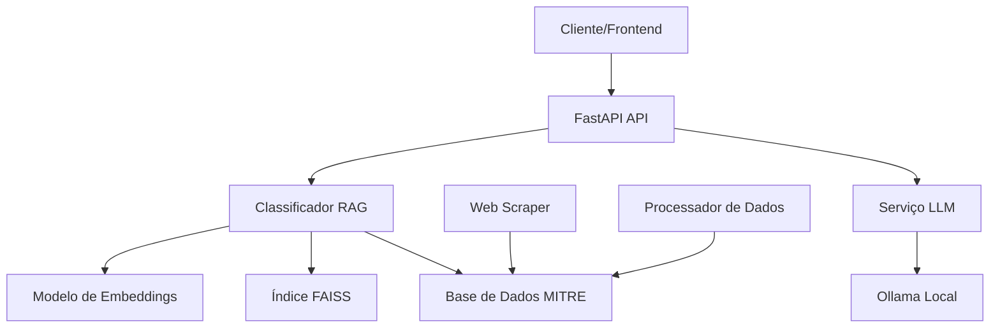

# MITRE ATT&CK Classifier API


Uma API inteligente para classificação automática de narrativas de segurança cibernética baseada no framework **MITRE ATT&CK**, desenvolvida pela **Junta.ai**. O sistema utiliza técnicas avançadas de NLP (Natural Language Processing) e RAG (Retrieval-Augmented Generation) para identificar automaticamente táticas e técnicas em descrições textuais de incidentes de segurança.

## Vídeo explicativo do projeto
[](https://youtu.be/JVHTHjqpuW8)

## 🎯 Funcionalidades Principais

- **Classificação Automática**: Identifica técnicas MITRE ATT&CK em narrativas de segurança
- **RAG (Retrieval-Augmented Generation)**: Busca semântica usando embeddings e FAISS
- **Análise com LLM**: Geração de respostas humanas detalhadas usando Ollama
- **API RESTful**: Interface completa com FastAPI e documentação automática
- **Multilíngue**: Suporte para português e inglês
- **Dados Enriquecidos**: Combinação de dados oficiais MITRE com cenários práticos

## 🏗️ Arquitetura do Sistema



### Componentes Principais

1. **API Layer** (`api/`):
   - FastAPI application com rotas RESTful
   - Middlewares CORS e logging
   - Schemas Pydantic para validação

2. **RAG Service** (`api/services/rag_service.py`):
   - Embeddings usando SentenceTransformers
   - Busca vetorial com FAISS
   - Classificação por similaridade semântica

3. **LLM Service** (`api/services/llm_service.py`):
   - Integração com Ollama
   - Geração de análises detalhadas
   - Suporte a múltiplos modelos

4. **Data Pipeline** (`data_op/`):
   - Web scraping do site oficial MITRE
   - Processamento e formatação de dados
   - Merge de dados oficiais com cenários práticos

## 📊 Pipeline de Dados

### 1. Aquisição de Dados

#### Dados Oficiais MITRE ATT&CK
```bash
# Execução do web scraper
python data_op/scrapper.py
```

**Processo**:
- Web scraping automatizado usando Playwright
- Coleta de 14 táticas principais do MITRE ATT&CK
- Extração de técnicas, descrições e metadados
- Geração do arquivo `data/raw/categories/mitre_training.json`

**Dados coletados**:
- **Táticas**: Reconnaissance, Initial Access, Execution, Persistence, etc.
- **Técnicas**: Mais de 180 técnicas catalogadas
- **Descrições**: Textos detalhados de cada técnica
- **Metadados**: IDs, nomes, relacionamentos

#### Cenários Práticos
Localização: `data/raw/situations/`
- **42+ cenários reais** de incidentes de segurança
- Narrativas detalhadas em português
- Mapeamento para técnicas MITRE específicas
- Correções e mitigações recomendadas

### 2. Processamento e Tratamento

#### Formatação dos Dados
```bash
# Processamento de dados de treinamento
python data_op/format_tuning_data.py

# Merge de dados oficiais e práticos
python data_op/merge_training_data.py
```

**Pipeline de processamento**:
1. **Normalização**: Limpeza e padronização de textos
2. **Estruturação**: Conversão para formato JSON estruturado
3. **Enriquecimento**: Combinação de dados oficiais com cenários práticos
4. **Validação**: Verificação de integridade e consistência

#### Estrutura dos Dados Processados
```json
{
  "input": "Descrição da técnica ou narrativa do incidente",
  "output": {
    "technique_id": "T1190",
    "technique_name": "Exploit Public-Facing Application",
    "tactic": "Initial Access",
    "correction": "Medidas de mitigação recomendadas"
  }
}
```

### 3. Base de Dados Final
Arquivo: `data/processed/mitre_techniques_complete.json`
- **Dados oficiais MITRE**: ~180 técnicas catalogadas
- **Cenários práticos**: 42+ situações reais mapeadas
- **Total**: 200+ entradas para classificação
- **Multilíngue**: Conteúdo em português e inglês

## 🚀 Instalação e Configuração

### Pré-requisitos
- Python 3.8+
- Ollama (para funcionalidades LLM)
- 8GB+ RAM (recomendado)

### Instalação

1. **Clone o repositório**:
```bash
git clone https://github.com/junta-ai/mitre-conversor.git
cd mitre-conversor
```

2. **Instale as dependências**:
```bash
pip install -r requirements.txt
```

3. **Configure o Ollama** (opcional, para análises LLM):
```bash
# Instalar Ollama
curl -fsSL https://ollama.ai/install.sh | sh

# Baixar modelo recomendado
ollama pull llama3.2:3b

# Iniciar serviço
ollama serve
```

4. **Verifique os dados**:
```bash
# Os dados já estão incluídos no repositório
ls data/processed/mitre_techniques_complete.json
```

### Configuração

O sistema usa configurações baseadas em `config.py`:

```python
# Principais configurações
EMBEDDING_MODEL = "all-MiniLM-L6-v2"  # Modelo de embeddings
LLM_MODEL = "llama3.2:3b"             # Modelo LLM local
API_PORT = 8000                       # Porta da API
```

## 🏃‍♂️ Execução

### Método Recomendado
```bash
python run.py
```

### Método Alternativo
```bash
uvicorn api.main:app --host 0.0.0.0 --port 8000 --reload
```

### Verificação
Acesse:
- **API**: http://localhost:8000
- **Documentação**: http://localhost:8000/docs
- **ReDoc**: http://localhost:8000/redoc

## 📡 API Endpoints

### Health Check
```http
GET /api/health
```
**Resposta**:
```json
{
  "status": "healthy",
  "rag_loaded": true,
  "techniques_count": 200,
  "llm_available": true,
  "llm_model": "llama3.2:3b"
}
```

### Classificação de Narrativas
```http
POST /api/classify
```

**Payload**:
```json
{
  "narrative": "Detectamos tentativas de exploração de vulnerabilidades em aplicações web expostas na nossa rede perimetral",
  "top_k": 5,
  "use_llm": true,
  "language": "pt-br"
}
```

**Resposta**:
```json
{
  "narrative": "Detectamos tentativas de exploração...",
  "techniques": [
    {
      "technique_id": "T1190",
      "technique_name": "Exploit Public-Facing Application",
      "tactic": "Initial Access",
      "similarity_score": 0.92,
      "description": "Adversários podem tentar...",
      "activity_description": null,
      "correction": null
    }
  ],
  "processing_time": 0.15,
  "human_response": "**Resumo Executivo**: Foi identificada uma tentativa de exploração...",
  "llm_metadata": {
    "model": "llama3.2:3b",
    "language": "pt-br",
    "generation_time": 2.3
  }
}
```

### Busca de Técnicas
```http
POST /api/search
```

**Payload**:
```json
{
  "query": "phishing email",
  "top_k": 10
}
```

## 🧠 Funcionamento do Sistema

### RAG (Retrieval-Augmented Generation)

1. **Embeddings**: Textos são convertidos em vetores usando SentenceTransformers
2. **Indexação**: Vetores são indexados com FAISS para busca eficiente
3. **Retrieval**: Busca por similaridade coseno entre query e técnicas
4. **Ranking**: Ordenação por score de similaridade (threshold: 0.7)

### Classificação Semântica

```python
# Fluxo simplificado
narrative = "Texto do incidente"
embedding = model.encode(narrative)
scores, indices = faiss_index.search(embedding, top_k=5)
techniques = [mitre_techniques[i] for i in indices if scores[i] > 0.7]
```

### Geração de Análises (LLM)

Quando `use_llm: true`:
1. Técnicas identificadas são enviadas para o Ollama
2. Prompt estruturado é gerado com contexto
3. LLM produz análise detalhada em linguagem natural
4. Resposta inclui resumo executivo, impacto e recomendações

## 📁 Estrutura do Projeto

```
mitre-conversor/
├── api/                          # API FastAPI
│   ├── main.py                  # Aplicação principal
│   ├── models/
│   │   └── schemas.py           # Schemas Pydantic
│   ├── routers/
│   │   ├── classifier.py        # Endpoints de classificação
│   │   └── health.py           # Health checks
│   └── services/
│       ├── rag_service.py      # Serviço RAG/embeddings
│       └── llm_service.py      # Serviço LLM/Ollama
├── data/                        # Dados e datasets
│   ├── raw/                    # Dados brutos
│   │   ├── categories/         # Dados oficiais MITRE
│   │   └── situations/         # Cenários práticos (42+)
│   ├── processed/              # Dados processados
│   └── training/               # Dados para fine-tuning
├── data_op/                    # Pipeline de dados
│   ├── scrapper.py            # Web scraper MITRE
│   ├── format_tuning_data.py  # Formatação para treinamento
│   └── merge_training_data.py # Merge de datasets
├── config.py                  # Configurações globais
├── settings.py               # Settings do projeto
├── run.py                   # Script de inicialização
└── requirements.txt         # Dependências Python
```

## 🔧 Tecnologias Utilizadas

### Backend & API
- **FastAPI**: Framework web moderno e rápido
- **Uvicorn**: Servidor ASGI de alta performance
- **Pydantic**: Validação de dados e serialização

### Machine Learning & NLP
- **SentenceTransformers**: Modelos de embeddings pré-treinados
- **FAISS**: Biblioteca para busca de similaridade vetorial
- **Transformers**: Biblioteca Hugging Face para modelos NLP

### LLM & IA
- **Ollama**: Runtime local para modelos de linguagem
- **Llama 3.2**: Modelo de linguagem de código aberto

### Data Processing
- **Playwright**: Automação web para scraping
- **Pandas**: Manipulação e análise de dados
- **NumPy**: Computação numérica

## 🧪 Exemplos de Uso

### Exemplo 1: Phishing Detection
```python
import requests

response = requests.post('http://localhost:8000/api/classify', json={
    "narrative": "Funcionários receberam emails suspeitos solicitando credenciais",
    "top_k": 3,
    "use_llm": true
})

# Resultado esperado: T1566 (Phishing)
```

### Exemplo 2: Lateral Movement
```python
response = requests.post('http://localhost:8000/api/classify', json={
    "narrative": "Detectado movimento lateral usando credenciais comprometidas",
    "top_k": 5
})

# Resultado esperado: T1021 (Remote Services), T1078 (Valid Accounts)
```

## 🔒 Segurança e Privacidade

- **Processamento Local**: Todos os dados são processados localmente
- **Sem telemetria**: Nenhum dado é enviado para serviços externos
- **CORS configurado**: Controle de acesso cross-origin
- **Validação de entrada**: Sanitização via Pydantic schemas

## 📄 Licença

Este projeto está licenciado sob a MIT License. Veja o arquivo `LICENSE` para detalhes.

## Créditos

- **MITRE Corporation**: Framework ATT&CK e dados oficiais
- **Hugging Face**: Modelos de embeddings e transformers  
- **Meta**: Modelo Llama 3.2
- **Junta.ai**: Desenvolvimento e implementação

---

**Desenvolvido com ❤️ pela equipe Junta.ai**
](https://youtu.be/JVHTHjqpuW8)
